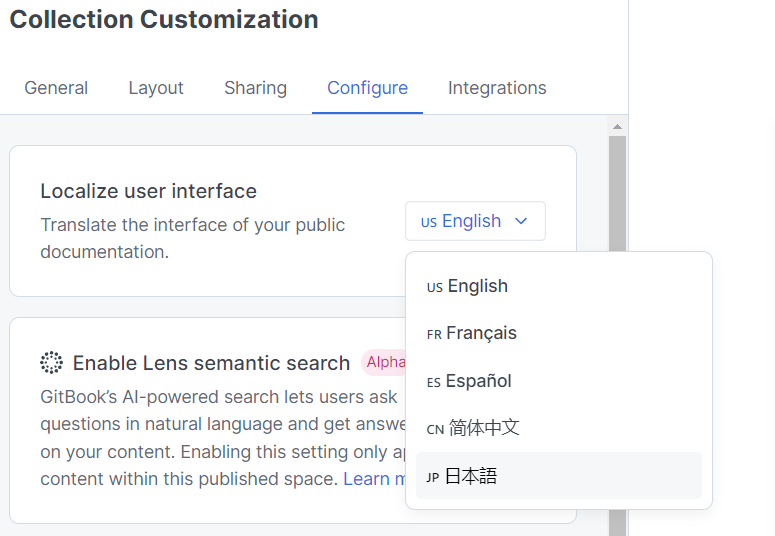

A multilingual documentation site is a website that hosts technical documentation in multiple languages. Such sites are commonly used by companies and organizations with a global user base who require their documentation to be accessible to users in multiple languages.

Multilingual documentation sites typically have a language selection feature that allows users to choose the language in which they prefer to read the documentation. This feature is usually located at the top or bottom of the site and is easily accessible.

Creating a multilingual documentation site can be a complex task, as it involves not only translating the content, but also ensuring that the structure and formatting of the documentation are consistent across all languages. It's important to work with experienced translators and localization specialists who can help ensure that the content is accurately translated and appropriately localized for each target audience.

There are various tools and platforms available that can help facilitate the creation of a multilingual documentation site, such as GitBook, ReadTheDocs, and Confluence. These platforms typically offer features such as translation management, version control, and integration with other tools and services.

Overall, a multilingual documentation site is an essential tool for companies and organizations that want to provide their users with high-quality technical documentation that is easily accessible and understandable in their preferred language.

## Multilingual sites in GitBook

GitBook allows you to create a site in multiple languages, which is especially useful if you have an audience that speaks different languages. To create a multilingual site in GitBook, you can create a separate publication for each language, and then link them together using the "languages" feature.

Here's how you can create a multilingual site in GitBook:

1. Create a new publication for each language you want to support. For example, you can create a publication for English and another publication for Spanish.

2. In each publication, create your content in the corresponding language. You can use GitBook's language switcher to switch between the publications and create content in each language.

3. Once you've created your content, go to the settings for one of the publications and click on the "Languages" tab.

4. Add the other publication(s) as a language option. For example, if you're in the English publication, you can add the Spanish publication as a language option.

5. You can then add links to switch between the languages in your publications. GitBook provides a language switcher component that you can use to add a dropdown menu that allows users to switch between the different language versions of your site.

With these steps, you can create a multilingual site in GitBook and provide your audience with content in multiple languages.